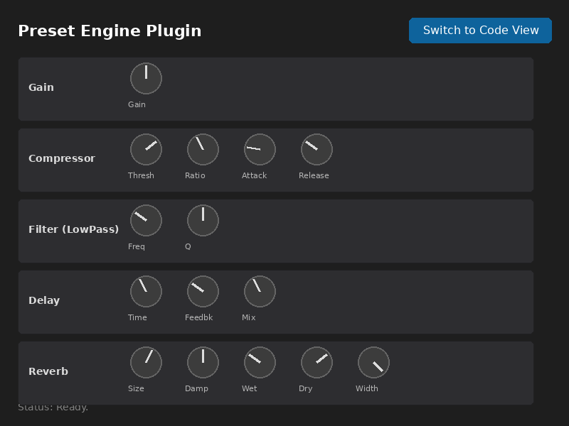
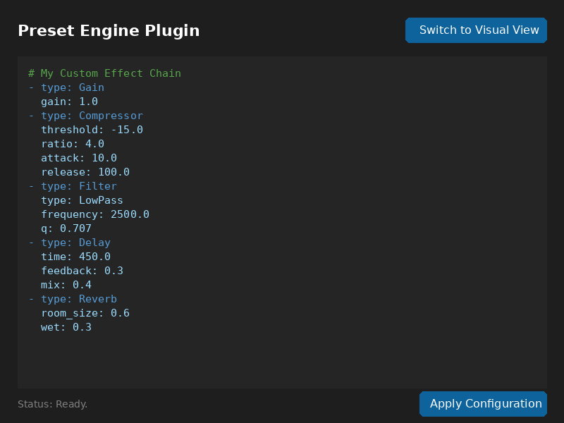

# Preset Engine Plugin

A modular, dynamically configurable VST3 audio plugin built with JUCE. This plugin allows you to define your audio processing chain using simple text configuration (YAML/JSON/XML) or interact with it using a generated visual interface.



## Features

*   **Modular Architecture**: Construct your signal chain from a library of building blocks.
*   **Dynamic Configuration**: Define your chain using YAML code. The plugin dynamically instantiates and routes the effects.
*   **Dual Interface**:
    *   **Code View**: Text editor for precise configuration and preset definition.
    *   **Visual View**: Automatically generated UI with sliders/knobs for all active parameters.
*   **Supported Formats**: YAML, JSON, and XML configuration parsing.

## Available Modules

The following audio effect modules are available for use in your chain:

*   **Gain**: Simple volume control.
*   **Filter**: Multi-mode IIR filter (LowPass, HighPass, BandPass, etc.).
*   **Compressor**: Dynamic range compressor.
*   **Limiter**: Peak limiter.
*   **Delay**: Stereo delay line with feedback and mix.
*   **Distortion**: Waveshaper overdrive/distortion.
*   **Phaser**: Modulation effect.
*   **Chorus**: Modulation effect.
*   **Reverb**: Algorithmic reverb.
*   **NoiseGate**: Simple noise gate.
*   **Panner**: Stereo panner.
*   **LadderFilter**: Moog-style ladder filter emulation.

## Usage

### Configuration (Code View)

In the Code View, you can define your chain as a list of objects. Each object must have a `type` property corresponding to a module name. Other properties control the parameters.

**Example YAML:**

```yaml
- type: Gain
  gain: 0.8

- type: Compressor
  threshold: -12.0
  ratio: 4.0
  attack: 10.0
  release: 100.0

- type: Filter
  type: LowPass
  frequency: 1000.0
  q: 0.707

- type: Reverb
  room_size: 0.5
  wet: 0.3
```



### Visual Control

Click the toggle button in the top-right corner to switch to the Visual View. This view presents a rack of modules corresponding to your configuration. You can adjust parameters in real-time.

*Note: The visual view controls the parameters of the active chain. To add/remove modules or change their order, switch back to the Code View.*

## Build Instructions

### Prerequisites

*   **CMake** (3.15 or higher)
*   **C++ Compiler** (supporting C++17)
*   **JUCE Dependencies** (Linux): `libasound2-dev`, `libx11-dev`, `libxrandr-dev`, `libxinerama-dev`, `libxcursor-dev`, `libgl1-mesa-dev`, `libfreetype6-dev`.

### Building

1.  Clone the repository:
    ```bash
    git clone https://github.com/stancsz/presets.git
    cd presets
    ```

2.  Configure with CMake:
    ```bash
    cmake -B build
    ```

3.  Build:
    ```bash
    cmake --build build --config Release
    ```

The built VST3 plugin will be located in the build directory (e.g., `build/PresetEngine_artefacts/Release/VST3/`).

## License

This project is licensed under the MIT License.
